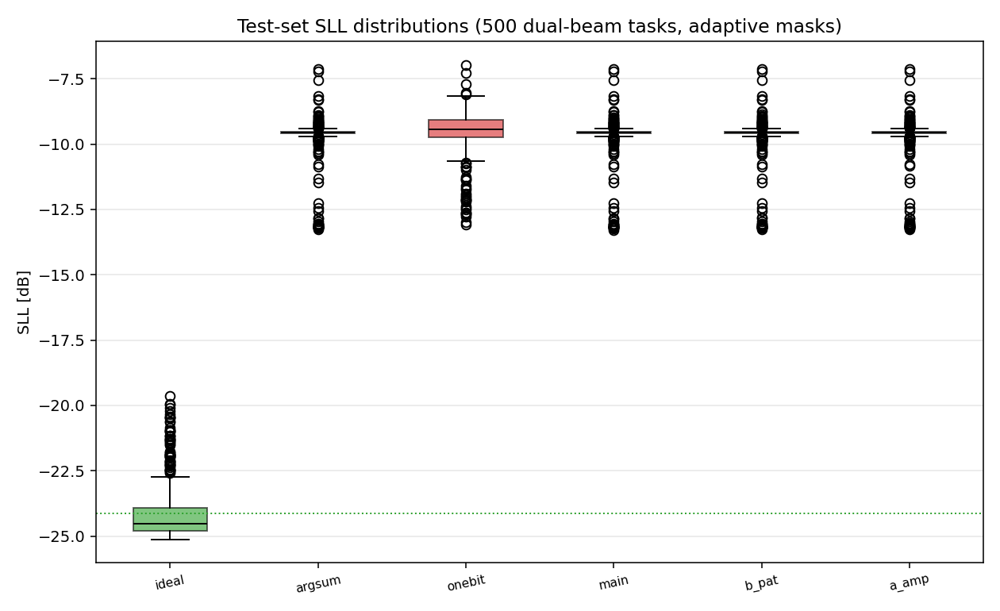
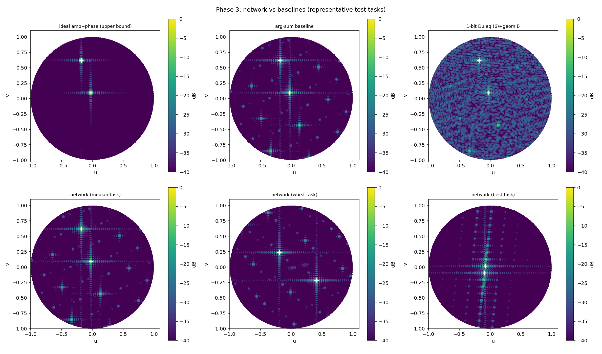
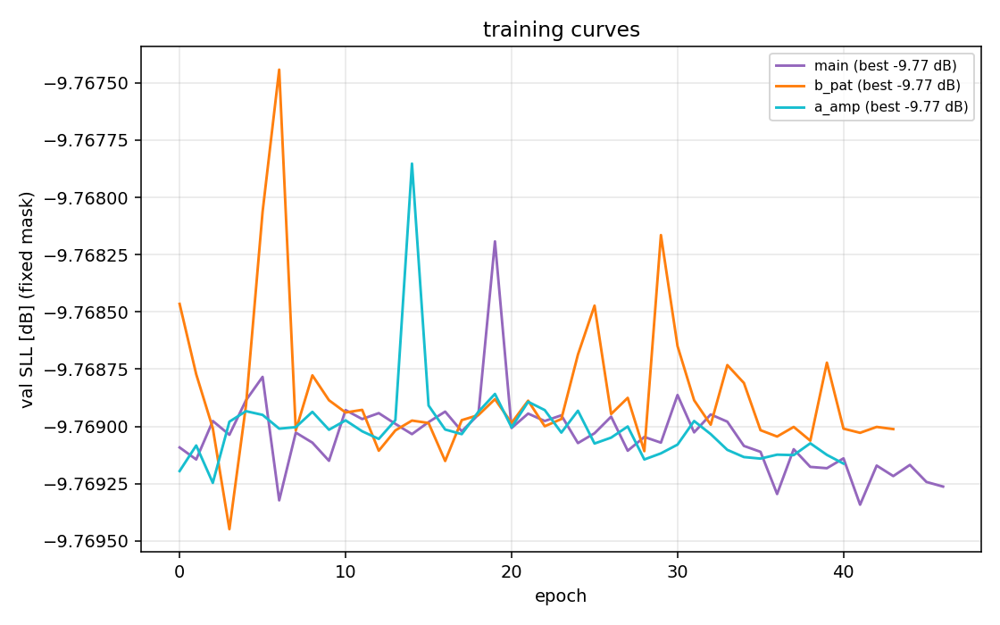

# 阶段 3 报告：双波束网络最小验证（方向一核心）

- 日期：2026-09-19 11:09
- 测试集：500 组留出双波束任务（独立种子 819）；指标：自适应首零点掩膜 + 亚网格插值（与基线完全同口径）
- 训练：U-Net（6ch 输入 / cos-sin 输出、幅度归一化），数据 4000/500，AdamW + 温度退火 LSE-SLL + 指向/增益/理想匹配项，交换增强 p=0.5

## 1 测试集 SLL（主结果）

| 方法 | SLL [dB] | 指向 max [°] | 一致性 [dB] |
|---|---|---|---|
| ideal amp+phase (ref) | -24.14 ± 1.12 | 0.005 | 0.02 |
| baseline 1=2 arg-sum | -9.70 ± 0.79 | 0.014 | 0.03 |
| 1-bit Du eq.(6)+geom B | -9.52 ± 0.79 | 0.037 | 0.28 |
| network (main) | -9.70 ± 0.79 | 0.014 | 0.03 |
| ablation: no L_pat | -9.70 ± 0.79 | 0.014 | 0.03 |
| ablation: no amp channel | -9.70 ± 0.79 | 0.014 | 0.03 |

## 2 方向一可行性判据（§1.3）

| 判据 | 阈值 | 实测 | 判定 |
|---|---|---|---|
| 主判据：vs arg-sum 基线改善 | ≥2 强 / 1–2 弱 / <1 回退 | -0.00 dB | 回退分析 |
| 辅助判据：vs 1-bit Du | 参考 | 0.18 dB | — |
| 与理想上界差距 | 参照 | -14.44 dB | — |
| 指向误差 | ≤0.5° | 0.272° | PASS |
| 增益一致性 | ≤1 dB（尽力） | 0.10 dB | PASS |
| 推理耗时 | GPU ≤5 ms | GPU 2.05 ms / CPU 21.5 ms | PASS |

## 3 消融与排列一致性

| 变体 | SLL [dB] | 与 main 差 |
|---|---|---|
| main | -9.70 ± 0.79 | +0.00 dB |
| b_pat | -9.70 ± 0.79 | +0.00 dB |
| a_amp | -9.70 ± 0.79 | -0.00 dB |

排列一致性（100 对）：|ΔSLL| 均值 0.003 dB / 最大 0.016 dB；|F| 归一化 L2 均值 1.25e-02。

## 4 训练曲线

## 5 结论

（见检查点 3 汇报）