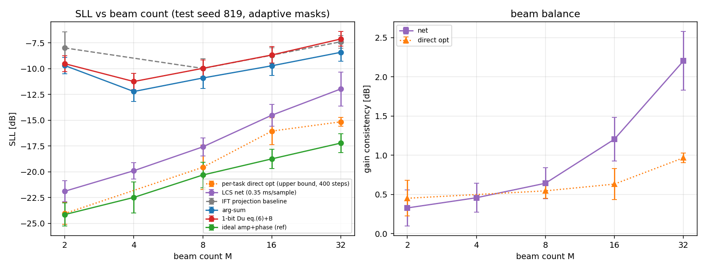

# 阶段 4 评测报告：LCS 多波束（金钱图口径）

- 日期：2026-09-26 19:34
- run=r2e ckpt=ckpt_best.pt（variant D，epoch 86，val_sll -20.13 dB）
- 测试：种子 819（M=2 为 500 任务，其余 200 任务/M）；自适应首零点掩膜 + 亚网格插值
- 训练 M 分布：[1, 2, 3, 4, 5, 6, 7, 8]
- 迭代基线（A3，100 任务/M，几何 A）：IFT 投影 / 逐任务直接优化（同损失，arg-sum 起点，400 步 Adam）

## 1 SLL vs M（主结果）

| M | net | direct-opt(ref) | IFT | arg-sum | 1-bit Du(B) | ideal(ref) | net 距 ideal | 改善 vs arg-sum |
|---|---|---|---|---|---|---|---|---|
| 2 | -21.88 | -24.03 | -7.99 | -9.70 | -9.52 | -24.14 | +2.26 dB | +12.18 dB |
| 4 | -19.89 | — | — | -12.21 | -11.24 | -22.48 | +2.59 dB | +7.68 dB |
| 8 | -17.58 | -19.56 | -9.97 | -10.90 | -9.97 | -20.31 | +2.73 dB | +6.67 dB |
| 16 | -14.51 | -16.05 | -8.69 | -9.72 | -8.67 | -18.74 | +4.23 dB | +4.79 dB |
| 32 | -11.96 | -15.15 | -7.39 | -8.41 | -7.12 | -17.21 | +5.25 dB | +3.55 dB |

耗时对照：direct-opt 10.7–112.5 s/任务（M 递增） vs net 批16 0.49 ms/样本（~10⁴–10⁵× 加速）；net 距 direct-opt -3.2–-1.5 dB（M 递增）。

## 2 判据核对（执行计划 v2.0 §3.2）

| M | SLL 目标 | 实测 | 判定 | cons 目标 | 实测 mean/max | 判定 | 指向 max |
|---|---|---|---|---|---|---|---|
| 2 | ≤-21.9（§3.2 冻结，抑制至少 21.9 dB） | -21.88 | FAIL | ≤1.0 | 0.33/1.06 | PASS | 0.127° |
| 4 | ≤-19.6（§3.2 冻结，抑制至少 19.6 dB） | -19.89 | PASS | ≤1.0 | 0.46/1.03 | PASS | 0.102° |
| 8 | ≤-17.1（§3.2 冻结，抑制至少 17.1 dB） | -17.58 | PASS | ≤1.0 | 0.64/1.33 | PASS | 0.243° |
| 16 | ≤-15.3（§3.2 冻结，抑制至少 15.3 dB） | -14.51 | FAIL | ≤1.5 | 1.20/1.90 | PASS | 0.257° |
| 32 | ≤-13.3（§3.2 冻结，抑制至少 13.3 dB） | -11.96 | FAIL | ≤2.0 | 2.20/3.28 | FAIL | 0.507° |

## 3 排列一致性（交换波束 0↔1）

- M=2: |ΔSLL| mean 0.000 / max 0.000 dB；|F| rel-L2 0.00e+00
- M=4: |ΔSLL| mean 0.000 / max 0.000 dB；|F| rel-L2 0.00e+00
- M=8: |ΔSLL| mean 0.000 / max 0.000 dB；|F| rel-L2 0.00e+00
- M=16: |ΔSLL| mean 0.000 / max 0.000 dB；|F| rel-L2 0.00e+00
- M=32: |ΔSLL| mean 0.000 / max 0.000 dB；|F| rel-L2 0.00e+00

## 4 推理耗时

- NPU 单样本 7.63 ms / 批16 0.49 ms/样本
